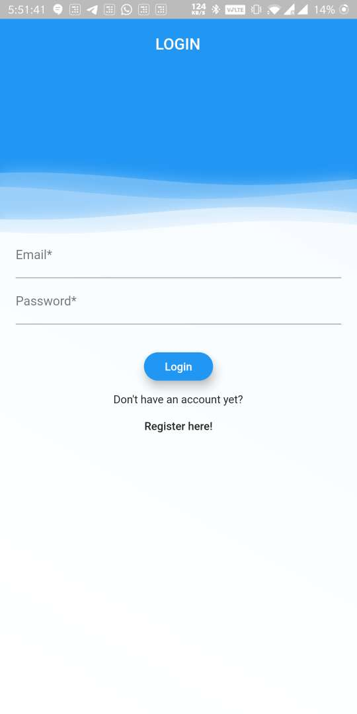
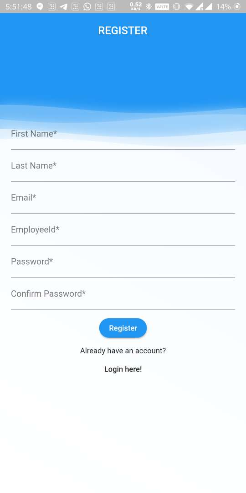
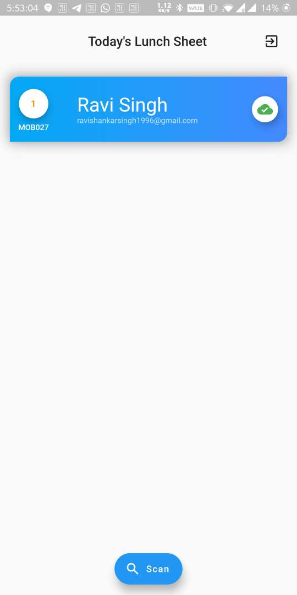
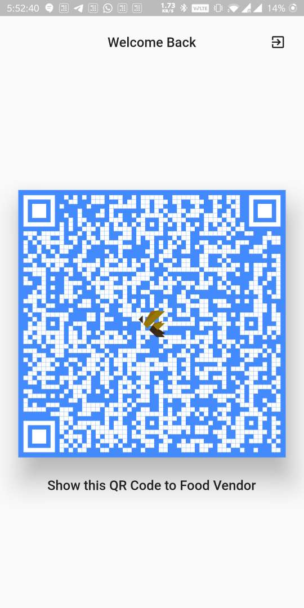
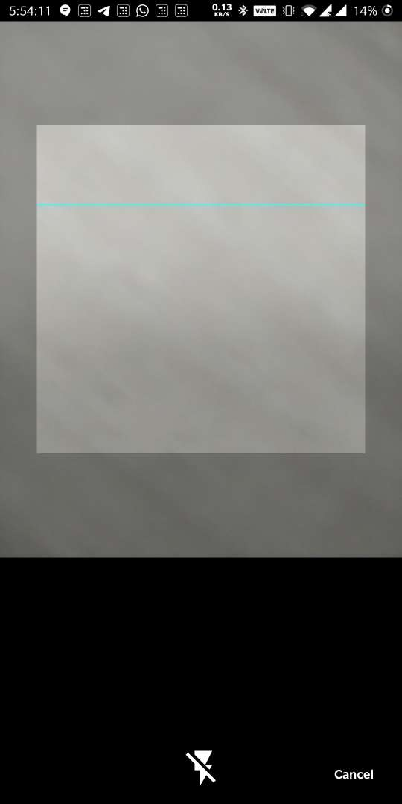
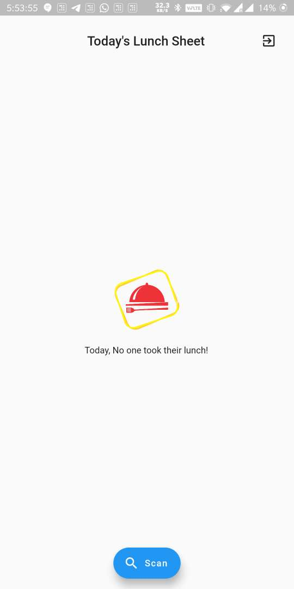

# FoodManger Flutter Application
A lunch sheet manager app for vendors and employess in Company.

This project is Open sourced by [ FluttreFly Community ](https://flutterfly.tech)

FoodManger
====

Splash, Login, and Signup
====

    

Food Vendor and User Screens
====

   

Empty Screen Vendor
====

^Contribution by [Ravi Shankar Singh](https://about.me/itsravishankarsingh) & [Rohit Pathak](https://github.com/rpathakmobcoder)

